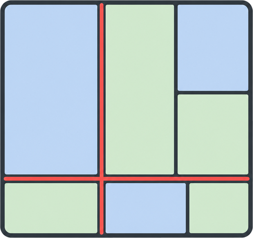
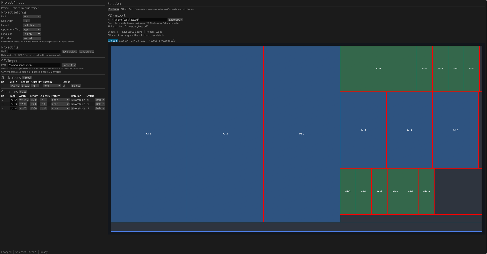
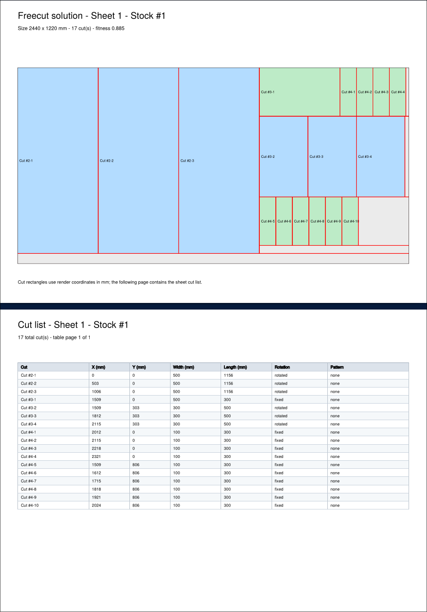

# Freecut

<p align="center">
  
</p>

Freecut is a free and open source desktop application for optimizing rectangular panel cuts.

It helps you plan how to cut stock sheets into required parts, with editable cut lists, configurable kerf width, visual solution previews, and PDF export.





## Freecut 2.0

Freecut 2.0 is a full Rust rewrite of the original Freecut application.

The classic FLTK-based implementation remains available in the Git history and as release `1.1.13`. Starting with Freecut 2.0, the project uses a new domain-centered implementation with an egui desktop interface, project files, CSV import, graphical previews, and improved export infrastructure.

This is an intentional hard transition: the old project history is preserved, while the new implementation becomes the main Freecut codebase.

## Features

- Editable stock sheet and cut piece lists
- Guillotine and nested layout modes
- Configurable kerf width
- Millimeter, inch, and foot project units
- Pattern direction handling
- Deterministic optimizer behavior
- Interactive graphical solution preview
- Red kerf/gap visualization in the GUI and PDF export
- PDF export with sheet drawings and cut lists
- CSV import for stock and cut lists
- Project save/load support
- English and German user interface

## Platform status

Freecut 2.0 is developed and tested primarily on NixOS/Linux.

Linux users can build and run Freecut directly with Cargo when Rust and the native `egui`/`eframe` GUI dependencies are installed:

```sh
cargo run
```

A Nix flake is included as the recommended reproducible development environment:

```sh
direnv allow
cargo run
```

Packaging for Arch Linux/AUR is planned separately.

Freecut uses `egui`/`eframe` and is intended to support Linux, Windows, and macOS. Windows and macOS release builds still need dedicated testing before they are advertised as stable.

CSV import is intentionally data-only: it imports stock and cut rows, but project settings such as unit, kerf width, layout, and optimizer effort remain project settings.

## Development checks

```sh
cargo fmt --check
cargo test --all
cargo clippy -- -D warnings
cargo clippy -- -W clippy::pedantic
```

## Classic Freecut

The last classic release is preserved as tag `1.1.13`.

## Credits

See [CREDITS.md](CREDITS.md).

## License

Freecut is licensed under the Apache License, Version 2.0.
